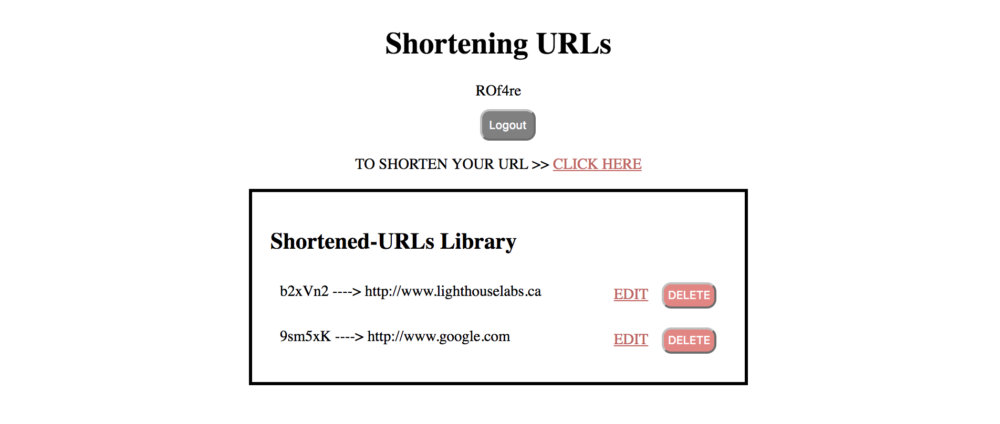
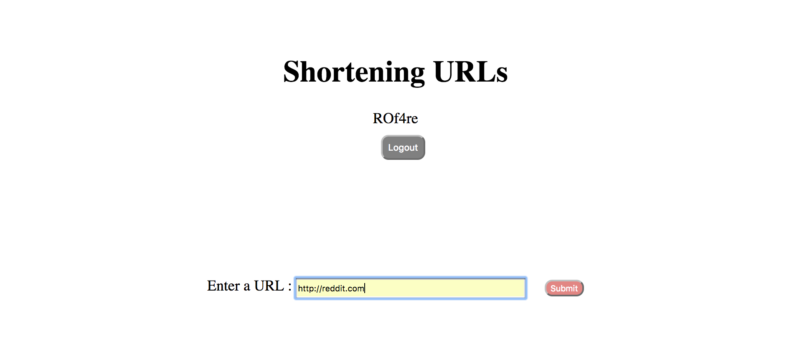
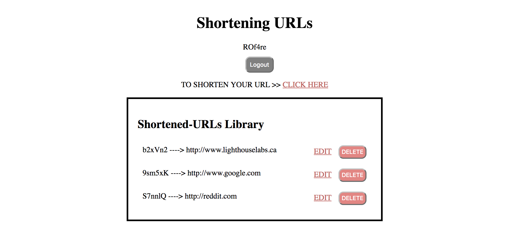
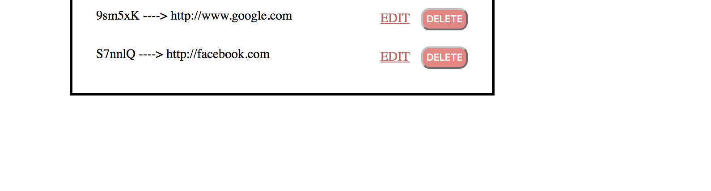

# TinyApp Project!

  TinyApp is a full-stack web application built with Node and Express that allows users to shorten longs
  URLs, which is similar to other web application like TinyURL, Bit.ly or Goo.gl

  This fully functional web-server(HTTP redirection) and API  will take a regular URL and transforms it into an encoded version, with the help of middleware servers, event-driven programming, and template engines.

## Dependencies

  - Node.js
  - Express
  - EJS
  - bcrypt
  - body-parser
  - cookie-session

# Behaviour (Back-end)

  ## Shortening URL

  1. Setting Cookie

      

      ["Changed Header after logged-in"](https://github.com/alynnlp/tweeter/blob/master/docs/signedin.png?raw=true)

      - Once user is logged in / registered, redirect to homepage displaying the user's name   

  2. Creating new data

      

      ["A form to submit long URL"](https://github.com/alynnlp/tweeter/blob/master/docs/generating.png?raw=true)

      - A form which contains: a text input field for the original (long) URL and a submit button which makes a POST request to /urls

  3. Deleting existing data

      

      - A function, where user is logged-in, using cookie-session to track if the user owns the specific URL, and give permission to user to delete their own URL while staying on the same page

  4. Updating existing data

      

      - A function, where user is logged-in, using cookie-session to track if the user owns the specific URL, and give permission to user to update their own URL
